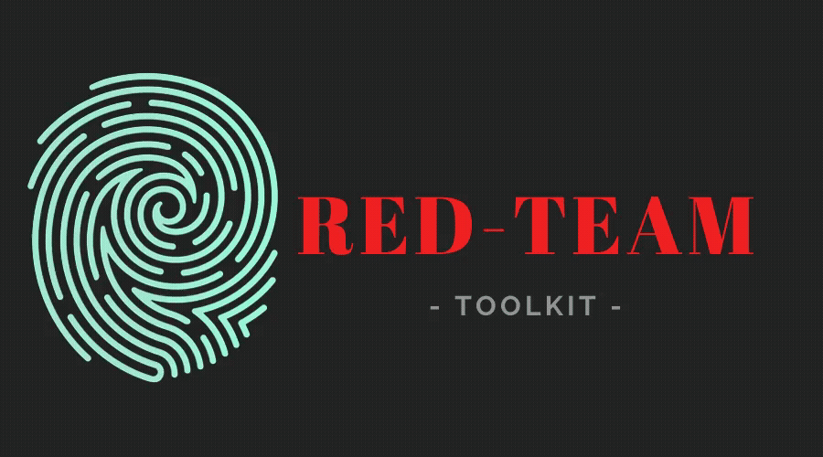
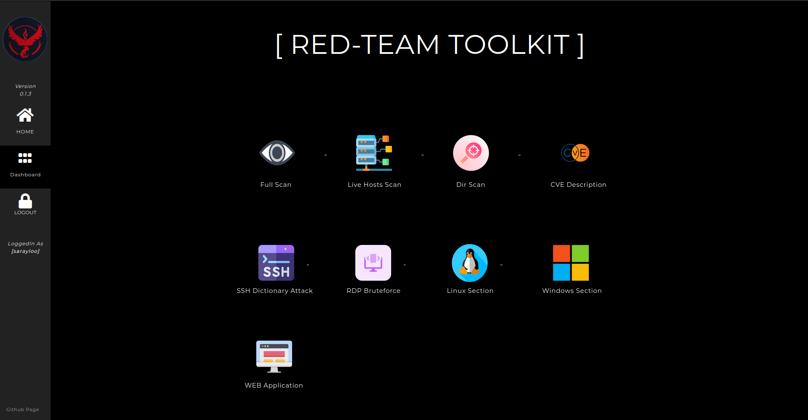

\

# RedTeam Toolkit
Red Team Toolkit is an Open-Source Django Offensive Web-App containing useful offensive tools used in the red-teamming together for the security specialist to identify vulnerabilities.

The open-source projects such as nmap, rustscan, dirsearch, shreder, circl, crowbar, etc are used what will be a powerful toolkit together.

\
**Currently it supports the following options:**
- FullScan (scan ports and vulnerabilities/CVEs on the target - PDF output)
- Livehosts (scan all live hosts in the network scale - PDF output)
- DirScan (scan all directories on a target - PDF output)
- CVE Description ( CveID Search)
- SSH Dictionary Attack
- RDP BruteForce
- WebApps Section
  - Apache Path Traversal PoC ( CVE-2021-41773 )
  - Web Crawler for gathering URLs
  - SubDomain Enumeration
  - HTTP Verb Tampering
  - (SQLi will be added soon)
- Windows Section (Being updated, other major CVEs will be added)
  - Microsoft Exchange ProxyShell PoC ( CVE-2021-34523, CVE-2021-34473, CVE-2021-31207 )
- Linux Section to implement major Linux CVEs (UNDER MAINTENANCE)\
\

  
